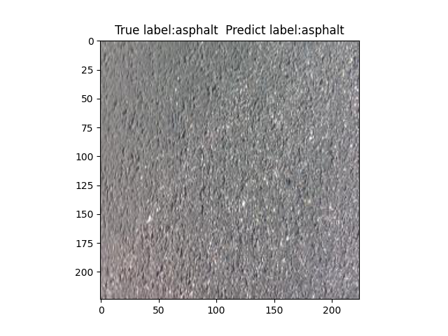
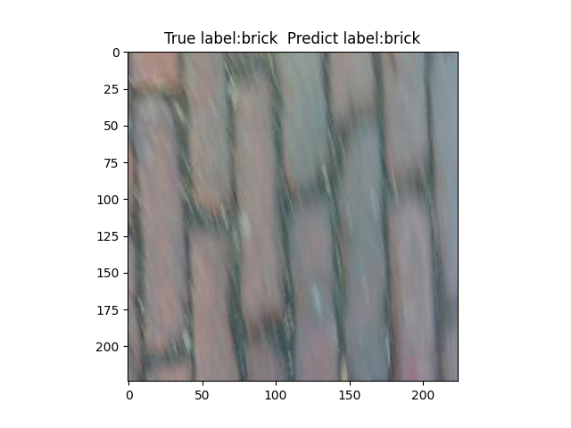
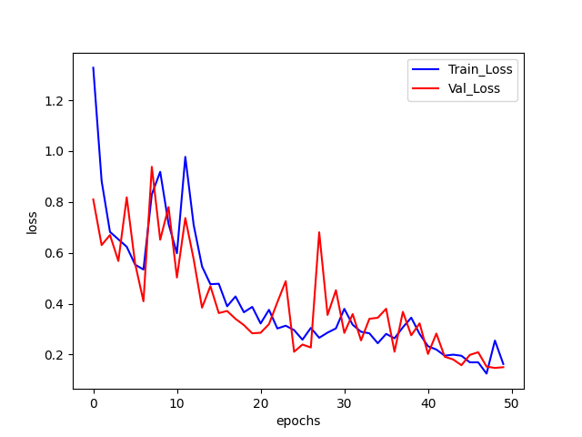
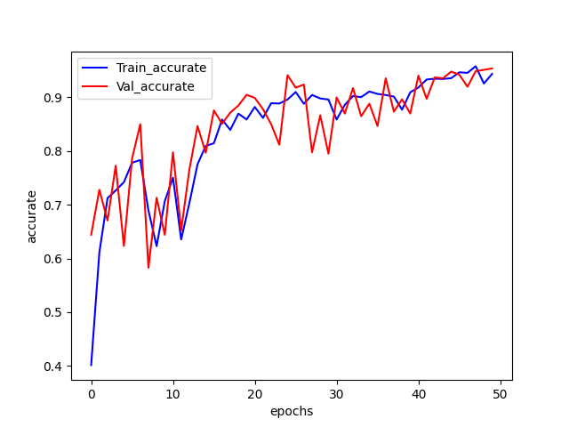

# Terrain classification
***Author***: Shiwei Liu, [College of Artificial Intelligence, Nankai University](https://aien.nankai.edu.cn/)

***E-mail***: 2011832@mail.nankai.edu.cn

## About this program
This project is my final assignment for the course "Deep learning" during my junior year(2022) at Nankai University.It is used to train a terrain classification model in order to distinguish where the robot is running thus we can switch the controllling policy of it. I used [AlexNet](https://proceedings.neurips.cc/paper_files/paper/2012/file/c399862d3b9d6b76c8436e924a68c45b-Paper.pdf) for reference and built a simular net structure despite the numbers of GPU (My PC only has one GPU RTX 3060). After training for 50 epochs, it can achieve 96.575% of train accuracy and 96.125% of test accuracy. 

## Requirements
1. You need a [conda](https://www.anaconda.com) enviroment with a suitable Python version:
    ```
    conda create -n YOUR_ENV_NAME python==3.9
    conda activate YOUR_ENV_NAME
    ```
2. Install pytorch(GPU version with your CUDA version), matplotlib, tqdm and numpy:
   ```
   pip3 install torch torchvision torchaudio --index-url https://download.pytorch.org/whl/cu117
   pip install matplotlib
   pip install tqdm
   pip install numpy
   ```
## Run this program
1. I provide this terrian dataset in the project file"dixing2" which is pre-seperated by **data_seperate.py**. If you wants to use the source dataset in your way [here](https://drive.google.com/file/d/1hNgvmXk9PifjSBLo2L4cESjqi8ncOcG7/view?usp=sharing) it is.
2. To train this model, run:
   ```
   python Building.py -- run_mode train --train_epochs YOUR_TRAIN_EPOCHS
   ```
   To test the result, run:
   ```
   python Building.py -- run_mode test
   ```
## Result
This dataset is plenty easy for this network. I tested this model on 800 images and got a 96.125% of accuracy after only 50 training epochs.



Test Figure 2 is taken while the robot is moving at high speed, and it also get a outstanding prediction.

I also show the training and evalidation loss and accuracy curve here:

 
